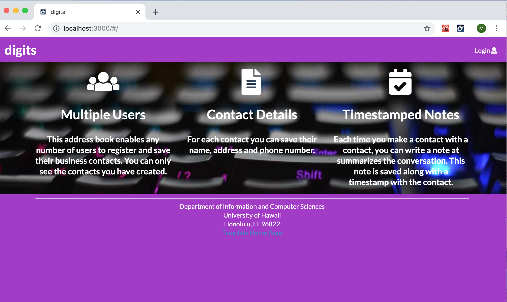
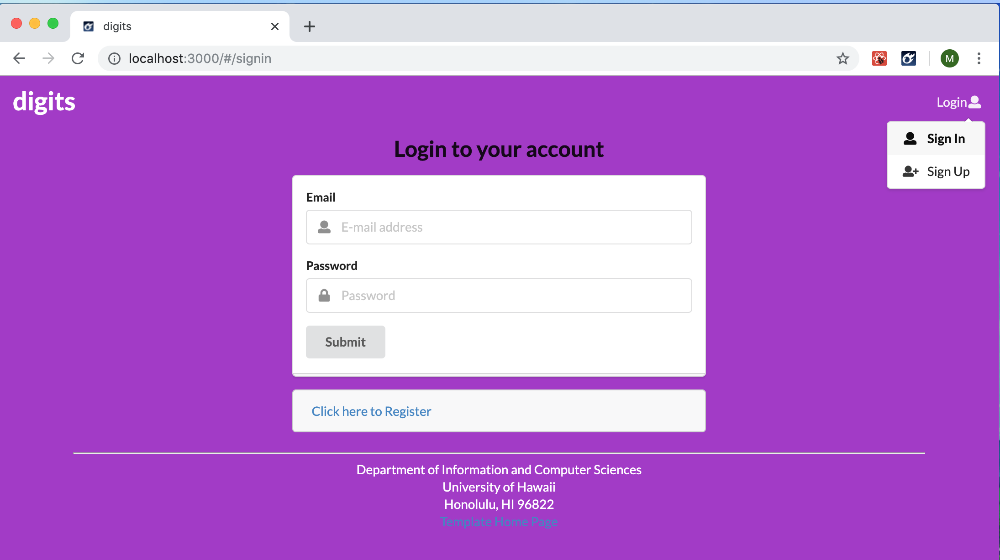
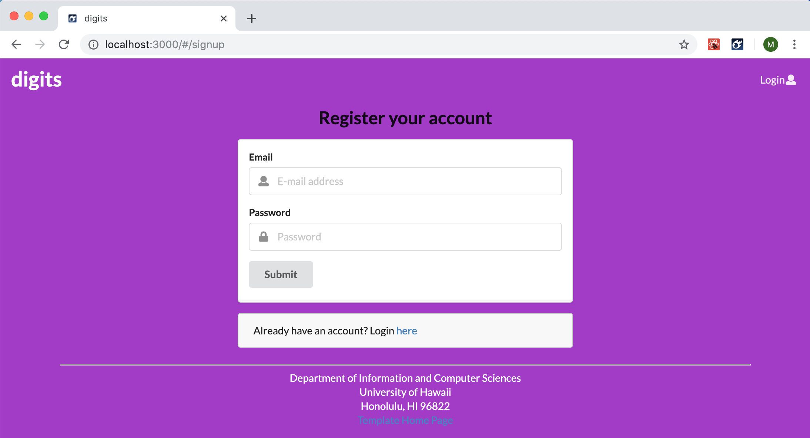
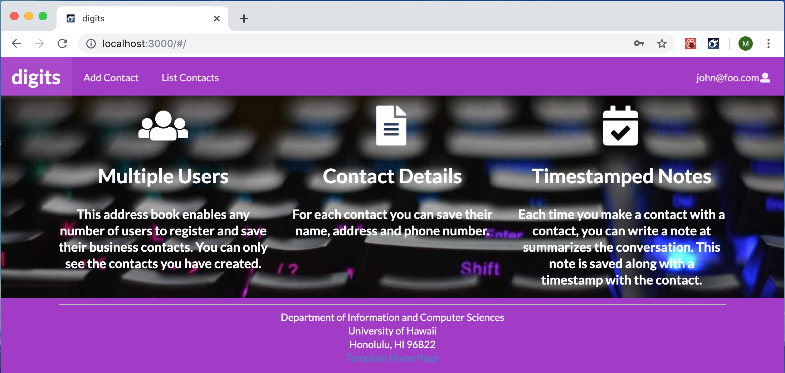
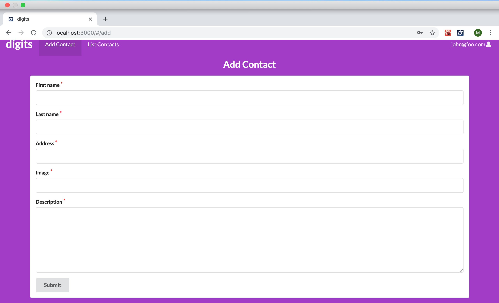
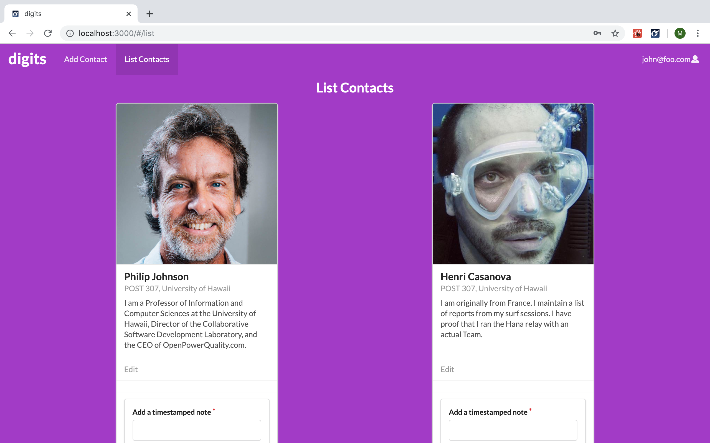
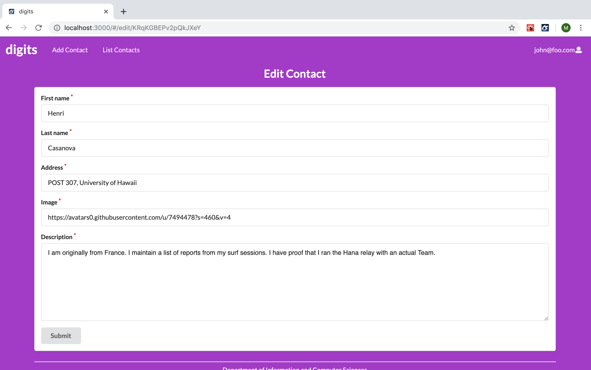
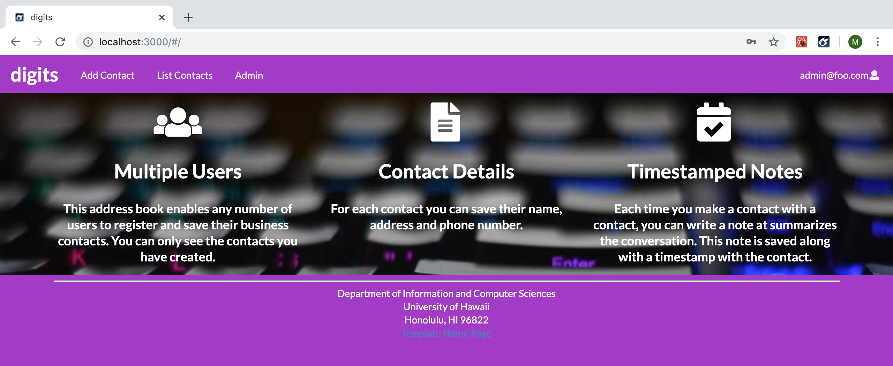
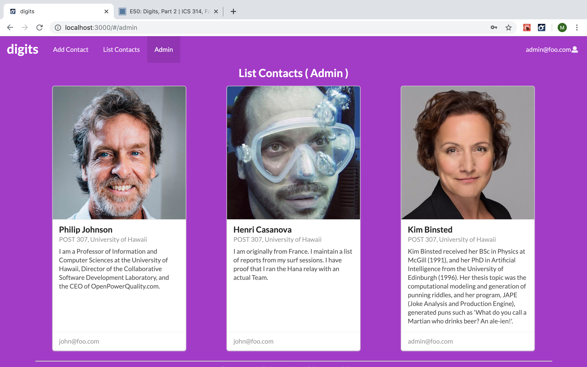

Digits allows users to make an account, contacts, and make timestamped notes associated to contacts. 

Digits is a sample Meteor application that illustrates:

  * A standard directory layout using 'imports/' as recommended in the [Meteor Guide](https://guide.meteor.com/structure.html)
  * [Semantic UI React](https://react.semantic-ui.com/) for user interface.
  * [Uniforms](https://uniforms.tools/) for form development.
  * [alanning:roles](https://github.com/alanning/meteor-roles) to implement a special "Admin" user.
  * Authorization, authentication, and registration using built-in Meteor packages.
  * Initialization of users and data from a settings file.
  * Alerts regarding success or failure of DB updates using [Sweet Alert](https://sweetalert.js.org/).
  * Quality assurance using [ESLint](http://eslint.org) with packages to partially enforce the [Meteor Coding Standards](https://guide.meteor.com/code-style.html) and the [AirBnB Javascript Style Guide](https://github.com/airbnb/javascript).

The goal of this application was to make a simple Meteor application using a template.

## Installation

First, [install Meteor](https://www.meteor.com/install).

Second, go to [https://github.com/mcalamasa/digits](https://github.com/mcalamasa/digits), and click the "Clone or download" button to download the digits GitHub repo to your local file system.  Using [GitHub Desktop](https://desktop.github.com/) is a great choice if you use MacOS or Windows.

Third, cd into the app/ directory of your local copy of the repo, and install third party libraries with:

```
$ meteor npm install
```

## Running the system

Once the libraries are installed, you can run the application by invoking the "start" script in the [package.json file](https://github.com/mcalamasa/digits/blob/master/config/settings.development.json):

```
$ meteor npm run start
```

The first time you run the app, it will create some default users and data. Here is the output:

```
meteor npm run start

> meteor-application-template-react@ start /Users/philipjohnson/github/ics-software-engineering/meteor-application-template-react/app
> meteor --no-release-check --settings ../config/settings.development.json

[[[[[ ~/github/ics-software-engineering/meteor-application-template-react/app ]]]]]

=> Started proxy.
=> Started MongoDB.
I20180227-13:33:02.716(-10)? Creating the default user(s)
I20180227-13:33:02.742(-10)?   Creating user admin@foo.com.
I20180227-13:33:02.743(-10)?   Creating user john@foo.com.
I20180227-13:33:02.743(-10)? Creating default data.
I20180227-13:33:02.743(-10)?   Adding: Basket (john@foo.com)
I20180227-13:33:02.743(-10)?   Adding: Bicycle (john@foo.com)
I20180227-13:33:02.743(-10)?   Adding: Banana (admin@foo.com)
I20180227-13:33:02.744(-10)?   Adding: Boogie Board (admin@foo.com)
=> Started your app.

=> App running at: http://localhost:3000/
```

The first time you run the app, it will create some default users and data. Here is the output:

```
meteor npm run start

> meteor-application-template-react@ start /Users/philipjohnson/github/ics-software-engineering/meteor-application-template-react/app
> meteor --no-release-check --settings ../config/settings.development.json

[[[[[ ~/github/ics-software-engineering/meteor-application-template-react/app ]]]]]

=> Started proxy.
=> Started MongoDB.
I20180227-13:33:02.716(-10)? Creating the default user(s)
I20180227-13:33:02.742(-10)?   Creating user admin@foo.com.
I20180227-13:33:02.743(-10)?   Creating user john@foo.com.
I20180227-13:33:02.743(-10)? Creating default data.
I20180227-13:33:02.743(-10)?   Adding: Basket (john@foo.com)
I20180227-13:33:02.743(-10)?   Adding: Bicycle (john@foo.com)
I20180227-13:33:02.743(-10)?   Adding: Banana (admin@foo.com)
I20180227-13:33:02.744(-10)?   Adding: Boogie Board (admin@foo.com)
=> Started your app.

=> App running at: http://localhost:3000/
```


### Note regarding "bcrypt warning":

You will also get the following message when you run this application:

```
Note: you are using a pure-JavaScript implementation of bcrypt.
While this implementation will work correctly, it is known to be
approximately three times slower than the native implementation.
In order to use the native implementation instead, run

  meteor npm install --save bcrypt

in the root directory of your application.
```

On some operating systems (particularly Windows), installing bcrypt is much more difficult than implied by the above message. Bcrypt is only used in Meteor for password checking, so the performance implications are negligible until your site has very high traffic. You can safely ignore this warning without any problems during initial stages of development.

### Note regarding "MongoError: not master and slaveOk=false":

Intermittently, you may see the following error message in the console when the system starts up:

```
MongoError: not master and slaveOk=false
     at queryCallback (/Users/philipjohnson/.meteor/packages/npm-mongo/.3.1.1.1mmptof.qcqo++os+web.browser+web.browser.legacy+web.cordova/npm/node_modules/mongodb-core/lib/cursor.js:248:25)
     at /Users/philipjohnson/.meteor/packages/npm-mongo/.3.1.1.1mmptof.qcqo++os+web.browser+web.browser.legacy+web.cordova/npm/node_modules/mongodb-core/lib/connection/pool.js:532:18
     at _combinedTickCallback (internal/process/next_tick.js:131:7)
     at process._tickDomainCallback (internal/process/next_tick.js:218:9)
```

While irritating, this message appears to be harmless and [possibly related to a race condition between the development instance of Mongo and Meteor](https://github.com/meteor/meteor/issues/9026#issuecomment-330850366). By harmless, I mean that in most cases, the console goes on to display `App running at: http://localhost:3000/` and no problems occur during run time.

### Viewing the running app

If all goes well, the template application will appear at [http://localhost:3000](http://localhost:3000).  You can login using the credentials in [settings.development.json](https://github.com/mcalamasa/digits/blob/master/config/settings.development.json), or else register a new account.

### ESLint

You can verify that the code obeys our coding standards by running ESLint over the code in the imports/ directory with:

```
meteor npm run lint
```

## Walkthrough

The following sections describe the major features of this application.

### Application functionality

The application implements a simple CRUD application for managing "Contact" and "Note", which are Mongo Collections.

By default, each user only sees the Contacts and Notes that they have created.  However, the settings file enables you to define default accounts.  If you define a user with the role "admin", then that user gets access to a special page which lists all the Contacts (not the notes) defined by all users.

#### Landing page

When you retrieve the app at http://localhost:3000, this is what should be displayed:


The next step is to use the Login menu to either Login to an existing account or register a new account.

#### Login page

Clicking on the Login link, then on the Sign In menu item displays this page:



#### Register page

Alternatively, clicking on the Login link, then on the Sign Up menu item displays this page:



#### Landing (after Login) page, non-Admin user

Once you log in (either to an existing account or by creating a new one), the navbar changes as follows:



You can now add new Contact documents, and list the Contacts you have created. Note you cannot see any Contact created by other users.

#### Add Contact page

After logging in, here is the page that allows you to add new Contacts:



#### List Contact page

After logging in, here is the page that allows you to list all the contacts along with its associated notes you have created:



You click the "Edit" link to go to the Edit Contact page, shown next.

#### Edit Contact page

After clicking on the "Edit" link associated with a contact, this page displays that allows you to change and save it:



#### Landing (after Login), Admin user

You can define an "admin" user in the settings.json file. This user, after logging in, gets a special entry in the navbar:



#### Admin page (list all users contacts)

The admin users can see all the contacts created by all of the users:



Non-admin users can't get to this page, even if they type in the URL by hand.

### Collections

The application implements a Collection called "Contacts". Each Contacts document has the following fields: firstName, lastName, address, image, description, and owner.

The Contacts collection is defined in [imports/api/contact/Contacts.js](https://github.com/mcalamasa/digits/blob/cleanup/app/imports/api/contact/Contacts.js).

The application also implements a Collection called "Notes". Each Notes document has the following fields: note, contactId, owner, and createdAt.

The Notes collection is defined in [imports/api/note/Notes.js](https://github.com/mcalamasa/digits/blob/cleanup/app/imports/api/note/Notes.js).
